技能掌握程度：熟练使用（熟悉典型应用场景）、理解原理和特性

# 一、Java 基础

## 1. 语法

### 泛型

https://docs.oracle.com/javase/tutorial/java/generics/inheritance.html

泛型别名参数化类型（parametered type），本质是一个【类或接口+类型变量】

```java
class Box<T> {}  
interface Comparable<T> {}
```

既然T是个类型参数，那么怎么给 T 赋值呢？

```java
Box<Integer> box = new Box<>(); // Integer 赋值给 T，同时使用类型推测 <>
// 注意：Integer 叫 argument，T 叫 parameter
```

T 的作用域分类作用域和方法作用域

```java
class Box<T> { // T 作用于整个类
	 private T value;
   public T getValue() {return value;}
}

// 在方法中引入类型变量 <T>，声明在返回类型前
public static <T> void compare(T[] array, T ele) { // T 限于该方法内
}
```

有界参数化类型，对T做限制

```java
// T 是 Comparable<T> 的子类，或者 Comparable<T> 是 T 的上界
public static <T extends Comparable<T>> void compare(T[] array, T ele) {
    for (T t : array) {
        if (t.compareTo(ele) > 0) {
            System.out.println(t);
        }
    }
}
```

可以有多个上界，但是类先于接口

```java
Class A { /* ... */ }
interface B { /* ... */ }
interface C { /* ... */ }

class D <T extends A & B & C> { /* ... */ }
```

类型参数T有继承结构，但泛型Box<T>的继承结构容易理解错误

```java
// Integer 和 Double 是 Number 的子类
public void someMethod(Number n) { /* ... */ }

someMethod(new Integer(10));   // OK
someMethod(new Double(10.1));   // OK

Box<Number> box = new Box<>();
box.add(new Integer(10));   // OK
box.add(new Double(10.1));  // OK

// 但是对于下面这个方法，类型不兼容，Box<Integer> 和 Box<Double> 不是 Box<Number> 的子类
public void boxTest(Box<Number> n) { /* ... */ }

boxTest(new Box<Integer>(10));   // error
boxTest(new Box<Double>(10.1));  // error
```

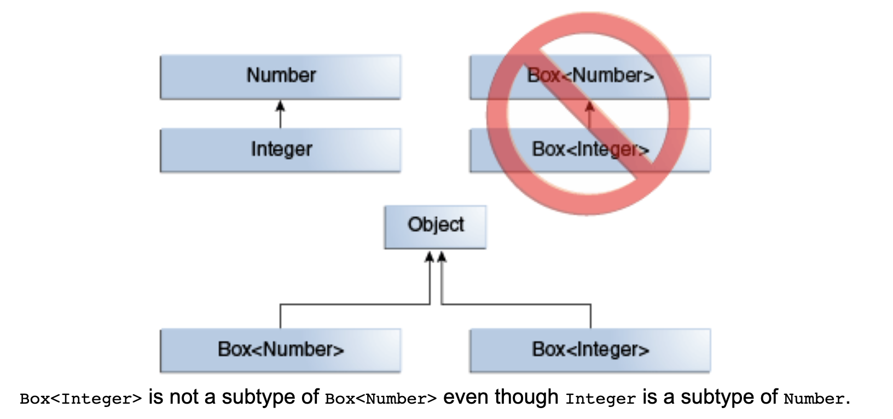


要实现泛型继承结构，需要通过 extends 和 implements，典型的泛型继承结构是jdk中的 ArrayList<E>

```java
public class ArrayList<E> implements List<E> {}

public interface List<E> extends Collection<E> {}
```

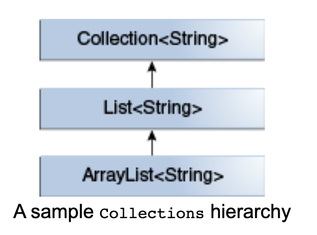

手动继承 ArrayList<E>，定义泛型继承关系

```java
static class Box<E, T> extends ArrayList<E> {}

public static void main(String[] args) {
    List<String> list1 = new Box<String, String>();
    List<String> list2 = new Box<String, Integer>();
    List<String> list3 = new Box<String, Exception>();
}
```

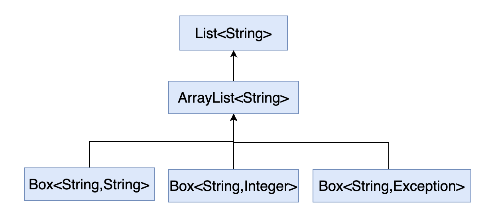


泛型中的通配符？，表示【未知】的泛型类型，区别于普通泛型【已知】的类型

```java
public void printList(List<? extends Number> list){} // ？表示未知，编译器不能推测类型

public <T> void printList(List<T> list){} // T 表示已知类型，编译器能进行类型推测
```


通过【有界通配符？】也可以实现泛型之间的继承关系

```java
public void printList(List<? extends Number> list) { /* ... */ }

printList(List.of(1, 2, 3));        // OK List<Integer> 是 List<? extends Nubmer> 子类

printList(List.of(1.0, 2.0, 3.0));  // OK List<Double> 是 List<? extends Nubmer> 子类
```

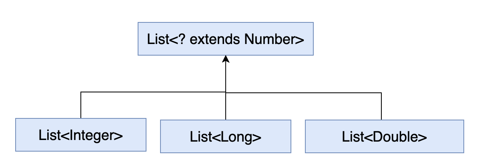


无界通配符？，用来表示【未知类型】，比如 List<?> 表示一个未知类型的list

```java
List<Object> 可以添加 Object 子类型的元素（包括Object自身）
  
List<?> 只能添加 null，因为 ？ 表示未知类型
```


无界通配符？也可实现泛型继承

```java
public void printList(List<Object> list) {} // 只能传入 List<Object> 类型

public void printList(List<?> list) {} // 可传入任何类型的List

public <T> void printList(List<T> list) {} // 等价与
```

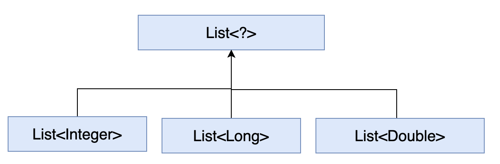


上界通配符<? super T> 表示类型 T 或 T 的父类型，表示的类型范围更广，方法更灵活


通配符捕获，即编译器通过类型推测，【确定？的具体类型】，如果不能确定，代码不能通过类型检查

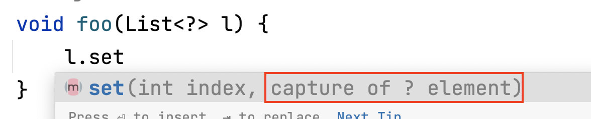

```java
void foo(List<?> l) {   // 编译器推测 l 为 Object 类型
    l.set(0, l.get(0)); // error, 编译器推测 l.get(0) 为 Object 类型，不能确定它的具体类型
}

void foo(List<?> l) {
  fooHelper(l);
}

void <T> fooHelper(List<T> l) { // 给编译器提供一个具体类型 T，编译器类型捕获（在这里是<T>）
  l.set(0, l.get(0)); // ok, 编译器推测 l.get(0) 为 T 类型
}

```


PECS原则（Producer Extends Consumer Super）

List<? extends T>常用在从列表中获取T【只读】，如果需要向列表中添加元素，应该使用List<? super T>

```java
List<? extends Number> ln = new ArrayList<>();
ln.add(1); // error

List<? super Number> ln = new ArrayList<>();
ln.add(1); // ok
```


### 静态类型 vs 动态类型

https://docs.oracle.com/cd/E57471_01/bigData.100/extensions_bdd/src/cext_transform_typing.html

Java 是静态类型、强类型语言，在编译时就检查变量、对象的类型，及早发现错误

Groovy 是动态类型语言，在运行时检查类型，容易导致书写错误，因为每次赋值都创建一个变量

```java
// Java example
int num;
num = 5;

// Groovy example
num = 5

// Groovy example
number = 5
numbr = (number + 15) / 2  // note the typo，此处书写错误，导致创建新的变量 numbr，而不是赋值 number 
```


## 多线程

### 线程池

#### ThreadPoolExecutor

1. 原理：重用线程，实现任务的并发执行和系统资源的合理使用

2. 特性：线程池参数配置系统资源

3. 应用场景：

   1. 定时批量任务执行：每日结算账单生成任务、重试任务

      ```java
      int CPU_COUNT = Runtime.getRuntime().availableProcessors();
      
      
      ```

      

#### Executors


### 同步工具

#### 数据竞争

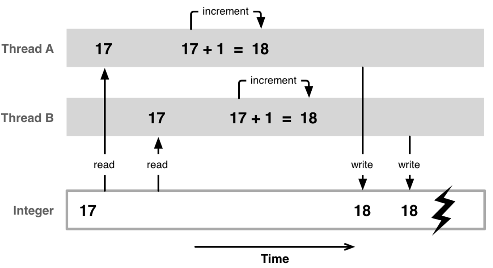

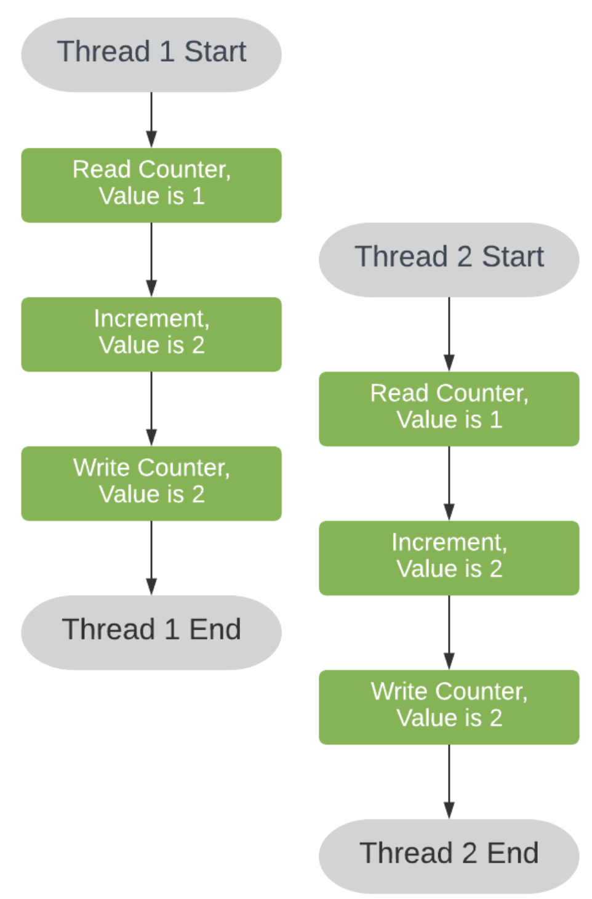


多线程并发读写同一个共享变量，会导致数据错误，本质是【更新】不是原子操作（读，修改，写），因此必须同步共享变量的读写，保证写变量的【原子性】

#### 轻量级同步工具

1. 使用【atomic】原子类

   ```java
   import java.util.concurrent.atomic.AtomicInteger;
   
   public class AtomicExample {
       private static AtomicInteger count = new AtomicInteger(0);
   
       public static void main(String[] args) throws InterruptedException {
           Thread t1 = new Thread(() -> {
               for (int i = 0; i < 1000000; i++) {
                   count.incrementAndGet();
               }
           });
           t1.start();
         
           for (int i = 0; i < 1000000; i++) {
               count.decrementAndGet();
           }
           
           t1.join();
           System.out.println(count.get()); // 0
       }
   }
   ```

   

2. 使用【ReentrantLock】可重入锁

   ```java
   import java.util.concurrent.locks.ReentrantLock;
   
   public class ReentrantLockExample {
       private static int count = 0;
       private static ReentrantLock lock = new ReentrantLock();
   
       public static void main(String[] args) throws InterruptedException {
           Thread t1 = new Thread(() -> {
               for (int i = 0; i < 1000000; i++) {
                   lock.lock();
                   count++;
                   lock.unlock();
               }
           });
   				t1.start();
         
            for (int i = 0; i < 1000000; i++) {
                 lock.lock();
               	count--;
               	lock.unlock();
             }
   
           t1.join();
           System.out.println(count); // 0
       }
   }
   ```

   

3. 使用【Semaphore】信号量

   ```java
   import java.util.concurrent.Semaphore;
   
   public class SemaphoreExample {
       private static int count = 0;
       private static Semaphore semaphore = new Semaphore(1);
   
       public static void main(String[] args) throws InterruptedException {
           Thread t1 = new Thread(() -> {
               for (int i = 0; i < 1000000; i++) {
                   try {
                       semaphore.acquire();
                       count++;
                   } catch (InterruptedException e) {
                       e.printStackTrace();
                   } finally {
                       semaphore.release();
                   }
               }
           });
           t1.start();
         
           for (int i = 0; i < 1000000; i++) {
               try {
                   semaphore.acquire();
                   count--;
               } catch (InterruptedException e) {
                   e.printStackTrace();
               } finally {
                   semaphore.release();
               }
           }
        
           t1.join();
           System.out.println(count); // 0
       }
   }
   ```

   

#### 1.2.2 计数器 CoutDownLantch


1. 原理：基于信号通知机制的同步计数器，同步线程执行顺序

2. 特性：阻塞当前线程，直到其他线程执行完某些操作或任务

3. 应用场景：

   1. 准备信号、开始信号、结束信号

      ```java
      static class Worker implements Runnable {
              private List<String> results;
              private CountDownLatch readySignal;
              private CountDownLatch startSignal;
              private CountDownLatch doneSignal;
      
              // 省略构造器
      
              @Override
              public void run() {
                  // 发送已准备信号
                  readySignal.countDown();
                  try {
                      // 等待执行信号
                      startSignal.await();
                      results.add("Counted down");
                  } catch (InterruptedException e) {
                      e.printStackTrace();
                  } finally {
                      // 发送已完成信号
                      // 必须放在 finally，防止异常未发送信号导致主线程一直阻塞
                      doneSignal.countDown();
                  }
              }
          }
      
          public static void main(String[] args) throws InterruptedException {
              int threadNums = 500;
              List<String> results = new ArrayList<>();
              CountDownLatch readySignal = new CountDownLatch(threadNums);
              CountDownLatch startSignal = new CountDownLatch(1);
              CountDownLatch doneSignal = new CountDownLatch(threadNums);
              List<Thread> workers = Stream
                      .generate(() -> new Thread(new Worker(results, readySignal, startSignal, doneSignal))).limit(threadNums).toList();
      
              workers.forEach(Thread::start);
              // 等待其他线程全部已准备信号
              readySignal.await();
              results.add("Workers ready");
              // 发送执行信号
              startSignal.countDown();
              // 等待其他现场全部已完成信号
              doneSignal.await();
              results.add("Workers complete");
      
              results.forEach(System.out::println);
               
              // Workers ready
              // Counted down
              // ... 
              // Workers complete
          }
      ```


## JVM

### 内存模型


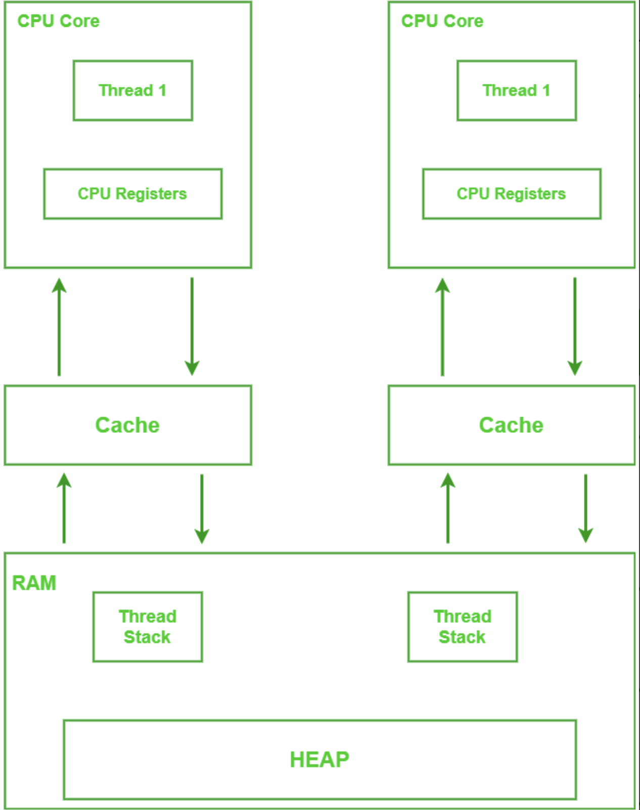


现代多核cpu处理器，每个core运行一个thread，都有它自己的缓存。虽然使用缓存提高了处理器性能，但是又引入了缓存一致性问题，即当core1更新一个共享变量时，在写回策略下，不同步更新内存，core2访问该共享变量时，不是最新值。同时，编译器优化可能会对指令重排序。导致两个问题【更新不可见】和【指令重排序】。

https://www.geeksforgeeks.org/write-through-and-write-back-in-cache/

https://www.geeksforgeeks.org/happens-before-relationship-in-java/

https://www.baeldung.com/java-volatile

#### 2.1.1 volatile 关键字

volatile 可以保证【更新可见性】和避免【指令重排序】

```java
public class VolatileExample {
  
  	private static volatile boolean ready = false;
    private static int number;

    public static void main(String[] args) throws InterruptedException {
        Thread writerThread = new Thread(() -> {
            number = 42; // 1. 写操作
            ready = true; // 2. 使用 volatile 保证写操作不会被重排序
        });
 				writerThread.start();

       
        while (!ready) {
            // 等待直到 ready 变为 true
        }
        System.out.println(number); // 3. 读操作，由于使用了 volatile，这里会保证在写操作完成后执行

        writerThread.join();
    }
}
// 如果 ready 不加 volatile 关键字有可能会打印 number 为 0 
// 1. writerThread 写 number 到主存存在延迟
// 2. 指令重排序，1 2 顺序对调
```


【更新可见性】就是线程能立即看到共享变量的最新值，use case1 【状态标志】：

```java
public class VolatileFlagExample {
    private static volatile boolean isRunning = true;

    public static void main(String[] args) throws InterruptedException {
        Thread workerThread = new Thread(() -> {
            while (isRunning) {
                // do some work
            }
        });

        workerThread.start();
        Thread.sleep(1000);
        isRunning = false; // 使 workerThread 能立刻读到 isRunning 最新值
    }
}
```


【避免重排序】use case2【双重检查锁定】，避免【半初始化】问题

```java
// 在单例模式中，我们有时会使用双重检查锁定（Double-Checked Locking）来确保单例对象只被创建一次。在这种情况下，我们需要将单例对象声明为volatile，以防止由于JVM的指令重排导致其他线程在对象实例化完成前就看到了该对象的引用。
public class Singleton {
    private static volatile Singleton instance;

    private Singleton() {}

    public static Singleton getInstance() {
        if (instance == null) {
            synchronized (Singleton.class) {
                if (instance == null) {
                    // JVM 中 instance = new Singleton() 它不是原子的，分为三个步骤
                    // 1. 分配对象的内存空间
                    // 2. 初始化对象
                    // 3. 将内存地址赋值给instance变量
                  	// 如果不加volatile，2 3可能交换顺序，导致其他线程拿到未初始化完的对象
                    instance = new Singleton(); 
                }
            }
        }
        return instance;
    }
}
```

https://www.baeldung.com/java-volatile

https://chat.openai.com/c/4952150e-9804-413c-8224-4fc3c21dd2ce

### 2.2 类加载机制

### 2.3 GC

### 2.4. 优化


# 二、算法

## 1. 数组

#### [剑指 Offer 04. 二维数组中的查找](https://leetcode.cn/problems/er-wei-shu-zu-zhong-de-cha-zhao-lcof/)

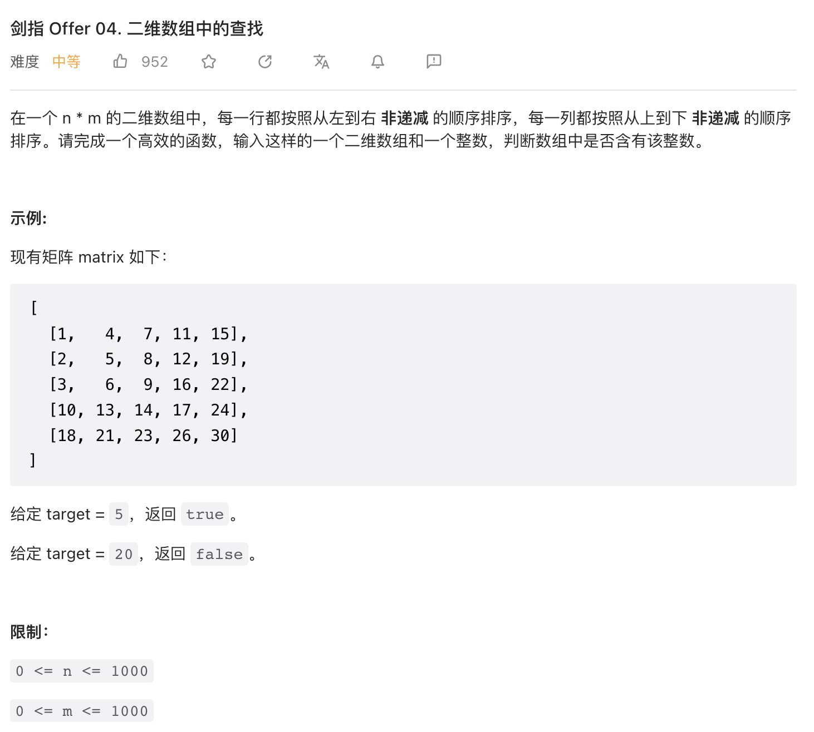

题目标签【找规律】【逆向思维】

题目分析：正向思维，从【左上角】向左向下遍历都是大于方向，没法判断路径。起点不对导致遍历方向错误。同理，从【右下角】向上和向左都是小于，同样无法判断路径。因此，从【左下角】或【右上角】，遍历方向一大一小，就可以判断路径。

```java
public boolean findNumberIn2DArray(int[][] matrix, int target) {
        // 异常判断
        if (matrix == null) return false;
        int n = matrix.length;
        if (n == 0) return false;
        int m = matrix[0].length;
        if (m == 0) return false;

        // 从右上角遍历，相当于二叉树遍历
        int i = 0, j = m - 1;
        while (i < n && j >= 0) {
            if (target == matrix[i][j]) return true;
            else if (target > matrix[i][j]) i++;
            else j--;
        }

        return false;
    }
```

[参考题解](https://leetcode.cn/problems/er-wei-shu-zu-zhong-de-cha-zhao-lcof/solution/mian-shi-ti-04-er-wei-shu-zu-zhong-de-cha-zhao-zuo/)


#### [剑指 Offer II 063. 替换单词](https://leetcode.cn/problems/UhWRSj/)

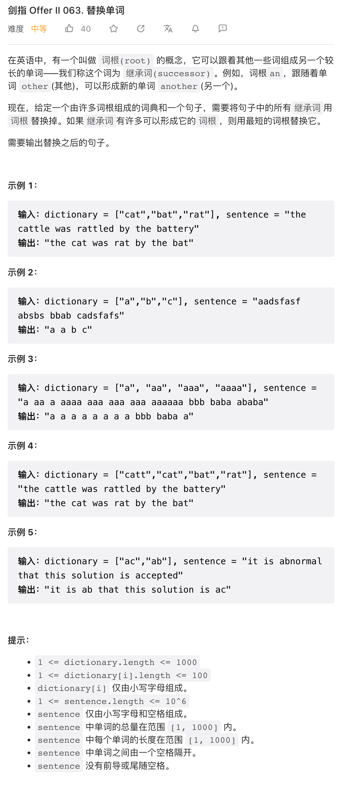

题目标签【hash】【前缀树】

题目分析：

hash 的思路是用空间换时间，hash 字典，在字典中查单词时间0(1)，然后用句子中的【单词前缀】在hash中查找。

```java
public String replaceWords(List<String> dictionary, String sentence) {
    Set<String> hash = new HashSet<>();
    for (String word : dictionary) {
        hash.add(word);
    }

    String[] words = sentence.split(" ");
    for (int i = 0; i < words.length; i++) {
        String word = words[i];
        // 遍历单词所有的前缀
        for (int j = 1; j <= word.length(); j++) {
            String prefixStr = word.substring(0, j);
            if (hash.contains(prefixStr)) {
                words[i] = prefixStr;
                break;
            }
        }
    }

    return String.join(" ", words);
}
```


# 三、框架

## 1. Spring

### 1.1 Spring IOC 容器

#### 1.1.1 DI 注入方式

##### 构造器注入（推荐）

特性：强制性依赖，返回完全初始化的状态，实现不可变对象

```java
@Component
@ToString
@RequiredArgsConstructor // final 字段且不为 null
public class People {
    private final Animal animal; // 不能注入 null
}

@Component
@ToString
public class People {
    private final Animal animal;
  
    public People(Animal animal) { // 不能注入 null，ioc 容器会忽略值为 null 的 bean，导致注入失败
        this.animal = animal;
    }
  	// Parameter 0 of constructor in com.example.beansioc.People required a bean of type 'com.example.beansioc.Animal' that 【could not be found.】
  	// The following candidates were found but 【could not be injected:】
	  // - User-defined bean method 'getAnimal' in 'Config' 【ignored as the bean value is null】
}

@Component
@ToString
public class People {
    private final Animal animal;
  
    public People(@Nullable Animal animal) { // 手动注入 null
        this.animal = animal;
    }
}
```


##### setter 注入

特性：非强制性依赖（可以设置默认值），可以重新注入

```java
@Component
@ToString
public class Person {
    private Animal animal;

    @Autowired
    public void setAnimal(@Nullable Animal animal) { // 注入null时，使用默认值
        this.animal = animal == null ? new Animal("default", 0) : animal;
    }
}

@Data
@AllArgsConstructor
public class Animal {
    private String name;
    private Integer age;
}

@Configuration
public class Config {
    @Bean(name = "animal")
    public Animal getAnimal() {
        return null;
    }
}
```


#### 1.1.2 循环依赖

A 依赖 B，B 依赖 A，对于单例Bean，通过三级缓存解决 B 循环依赖 A，缓存A的引用（未初始化状态）

```java
@Component
@AllArgsConstructor
public class A {
    private B b;
}

@Component
@AllArgsConstructor
public class B {
    private A a;
}


The dependencies of some of the beans in the application context form a cycle:

┌─────┐
|  a defined in file [/Users/yangwu/IdeaProjects/spring/beans-ioc/target/classes/com/example/beansioc/cycle/A.class]
↑     ↓
|  b defined in file [/Users/yangwu/IdeaProjects/spring/beans-ioc/target/classes/com/example/beansioc/cycle/B.class]
└─────┘


Action: // 要么手动删除依赖，要么设置允许循环依赖属性

Relying upon circular references is discouraged and they are prohibited by default. Update your application to 【remove the dependency cycle】between beans. As a last resort, it may be possible to break the cycle automatically by【setting spring.main.allow-circular-references to true】.
```

对于原型Bean，因为每次创建新的对象，无法通过缓存解决循环依赖


#### 1.2.3 延迟初始化

Spring 容器【默认在启动时】创建并初始化Bean，可以及早发现循环依赖的问题；而 @Lazy 可以推迟创建和初始化Bean 

```java
@Component @Lazy
public class LazyBean {
    private String name = "LazyBean";
    public LazyBean() {
        System.out.println("My name is " + name);
    }
}

@SpringBootApplication
public class BeansIocApplication {

	public static void main(String[] args) {
		ConfigurableApplicationContext context = SpringApplication.run(BeansIocApplication.class, args);
		context.getBean(LazyBean.class); // 延迟到使用时创建和初始化 LazyBean
	}
}
```

**@Lazy** 解决的问题：

- 加快容器启动速度：延迟创建重量级别的Bean（占用大量时间和资源，如网络连接、加载大文件）
- 合理分配资源：避免大量资源被闲置浪费

使用前提：

- 某些Bean创建初始化时间长（网络、磁盘）影响容器启动速度，属于【慢Bean】
- 某些Bean占用大量资源且资源利用率很低，属于【占着茅坑不拉屎的Bean】


#### 2.1.1 Bean 生命周期

1. 原理：根据配置扫描创建 Bean 对象，同时提供各种回调接口用于自定义初始化、销毁等逻辑

2. 特性：提供各阶段的回调接口用于自定义逻辑

3. 应用场景：

   1. 自定义初始化逻辑 @PostConstruct 和自定义销毁逻辑 @PreDestroy

      ```java
      // 定义 POJO 类
      public class MySpringBean {
          @PostConstruct
          public void init() {
              System.out.println("custom init...");
          }
        
          public void greeting() {
              System.out.println("hello my name is " + this.getClass().getSimpleName());
          }
      
          @PreDestroy
          public void destroy() {
              System.out.println("custom destroy...");
          }
      }
      
      // 定义 Bean 配置类
      @Configuration
      public class BeanConfig {
          @Bean(name = "bean")
          public MySpringBean mySpringBean() {
              return new MySpringBean();
          }
      }
      
      
      // @Resource 依赖注入
      @SpringBootApplication
      public class BeanLiftCycleApplication implements CommandLineRunner {
      
          @Resource(name = "bean")
          private MySpringBean bean;
      
          public static void main(String[] args) {
              SpringApplication.run(BeanLiftCycleApplication.class, args);
          }
      
          @Override
          public void run(String... args) throws Exception {
              bean.greeting();
          }
      }
      
      // 输出
      custom init...
      hello my name is MySpringBean
      custom destroy...
      ```

      


#### AOP 切面

1. 原理：
2. 特性：
3. 应用场景：
   1. AOPContext 

#### Spring 事务

1. 原理：
2. 特性：
3. 应用场景：
   1. @Transaction 注解

#### 2.1.3 依赖注入

1. 原理：
2. 特性：
3. 应用场景
   1. @Autowire 和 @Resource

#### 2.2 SpringMVC

2.2.1 前端请求流程

2.2.2 拦截器

#### 2.3 MyBatis


# 三、中间件

#### 3.1 Redis

#### 3.2 MQ

#### 3.3 ES


# 四、数据库

## 4.1 MySQL

## 4.2 分库分表


## 4.3 分布式事务

## 4.2 SQL 优化


# 五、系统架构

#### 5.1 分布式

#### 5.2 微服务

5.2.1 SOA

5.2.2 RPC

#### 5.3 负载均衡


# 六、设计模式

#### 1. 策略接口（策略模式）

策略就是根据条件【选择】不同实现方式，比如我要去北京出差，就有多种【出行方式】（飞机、火车、开车等），但是具体选那种方案是由特定的条件决定的，这就是策略

一般策略接口定义了目标，而子类实现不同的方式方案

```java
interface RouteStrategy {
    Route getRoute(Location start, Location end);
}

class ShortestTimeStrategy implements RouteStrategy {
    @Override
    public Route getRoute(Location start, Location end) {
        // 计算最短时间的路径
    }
}

class CheapestStrategy implements RouteStrategy {
    @Override
    public Route getRoute(Location start, Location end) {
        // 计算价格最便宜的路径
    }
}
```

在使用时，只需要根据配置条件就可以进行【策略替换】，当需要新的策略时，只需要新增一个实现类，而不需要修改现有代码。

```java
RouteStrategy strategy;
if (userChoice == UserChoice.SHORTEST_TIME) {
    strategy = new ShortestTimeStrategy();
} else if (userChoice == UserChoice.CHEAPEST) {
    strategy = new FewestTrafficLightsStrategy();
}
Route route = strategy.getRoute(start, end);
```


#### 2. 适配器 Adapter


#### 3. 过滤器 Filter

过滤器就是根据条件进行匹配 match，留下（过滤出）目标值


#### 4. 访问者 Visitor 

解决什么问题？

把额外的操作逻辑从一个类型结构中独立出来，放在一个单独的接口中，保持原来类型结构的聚合

本质？

使原来的类型结构保持独立，同时为其他【外部逻辑】提供访问自身的【入口】，即访问者

如何实现？

类型结构必须开放【访问点】，供外部访问者访问数据

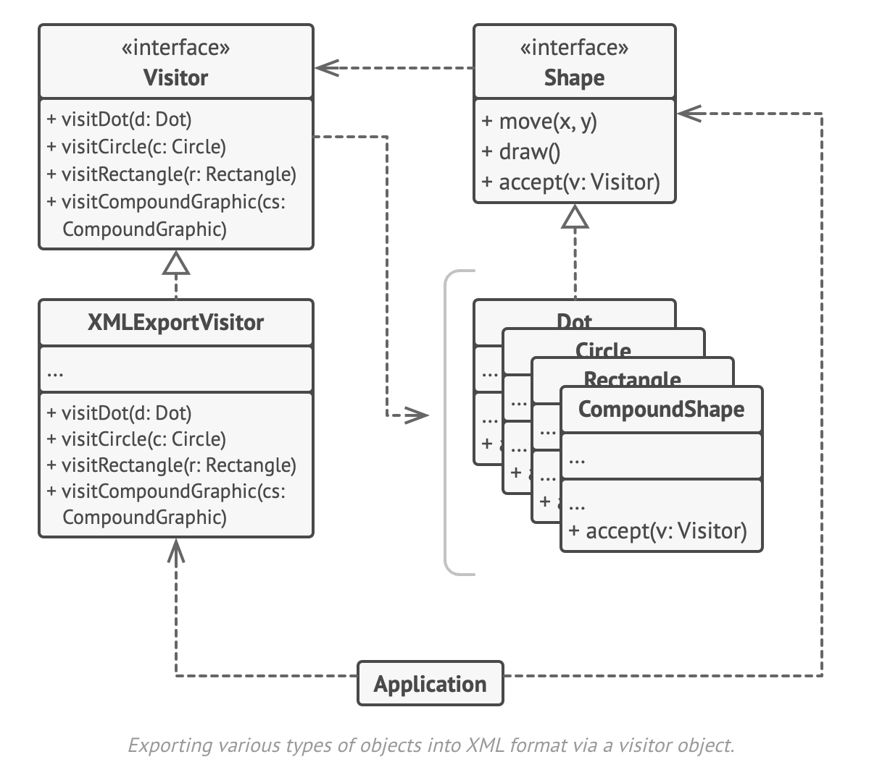

```java
public class VisitorDemo {
  
    interface Shape {
        void draw();
        void accept(Visitor visitor); // 开放【访问点】
    }

    static class Dot implements Shape {
        public Dot() {}
        @Override
        public void draw() {
            // ...
        }
        @Override
        public void accept(Visitor visitor) {
            visitor.visit(this); // 委托给visitor
        }
    }

    static class Circle implements Shape {
        public Circle() {}
        @Override
        public void draw() {
            // ...
        }
        @Override
        public void accept(Visitor visitor) {
            visitor.visit(this); // 委托给visitor
        }
    }

    interface Visitor { 
        void visit(Dot dot);
        void visit(Circle circle);
    }

    class XMLExportVisitor implements Visitor {
        @Override
        public void visit(Dot dot) {
            System.out.println("Exporting dot to XML");
        }
        @Override
        public void visit(Circle circle) {
            System.out.println("Exporting circle to XML");
        }
    }

    public static void main(String[] args) {
        Shape dot = new Dot();
        Shape circle = new Circle();
        Visitor visitor = new VisitorDemo().new XMLExportVisitor();
        dot.accept(visitor);
        circle.accept(visitor);
      
      	// output:
        // Exporting dot to XML
        // Exporting circle to XML
    }

}
```


该模式的替换：https://github.com/nurkiewicz/typeof

https://refactoring.guru/design-patterns/visitor

https://en.wikipedia.org/wiki/Visitor_pattern#:~:text=In%20object%2Doriented%20programming%20and,structures%20without%20modifying%20the%20structures.

#### 6.1 工厂

#### 6.2 代理

#### 6.3 职责链


# 七、军规

1. 蚂蚁军规

   

2. 


