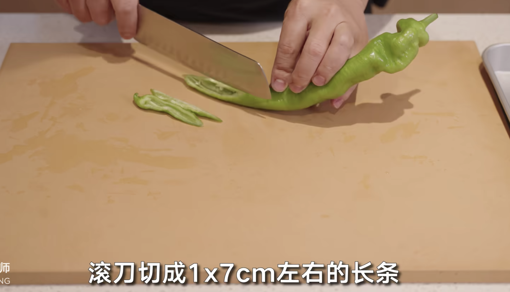
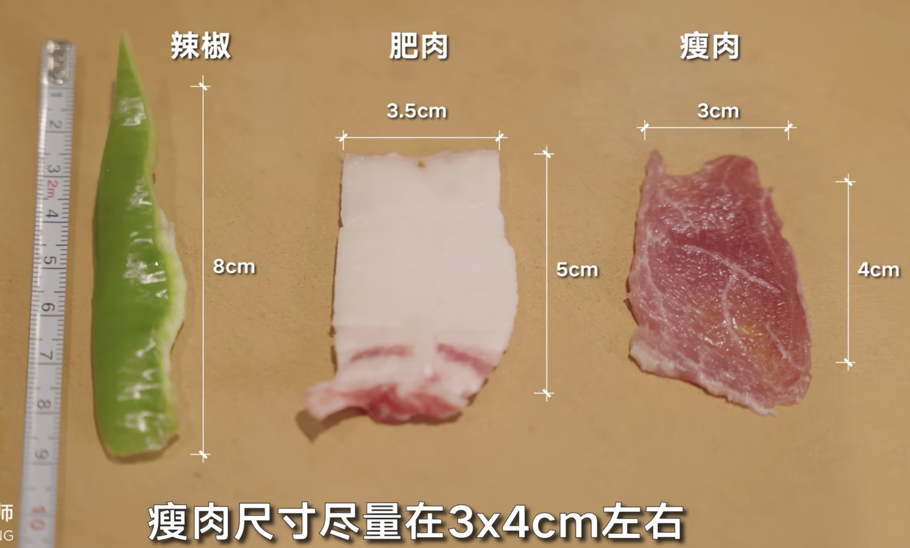

## 一、炒菜

### 1.  辣椒炒肉

【蒜和豆豉】【可选】

### 1.1 辣椒

【选薄皮辣椒】【洗净擦干】

【切细切平】

### 1.2 瘦肉

【前腿肉】【肥肉切3mm】【瘦肉切1mm】【提前冷冻2h更好切】

【瘦肉3*4】【肥肉稍大】

### 1.3 流程

1. 下10g底油，180度不冒烟下肥肉，中火炒1分钟
2. 到略微焦黄时，放入青椒，加一半（2g）的盐，大火炒30s，用铲子压一下
3. 到青椒略微虎皮时，放入瘦肉和另一半盐（2g），再炒1分钟
4. 倒出多余的油
5. 加入酱油和鸡精，加入20ml水
6. 收干出锅

