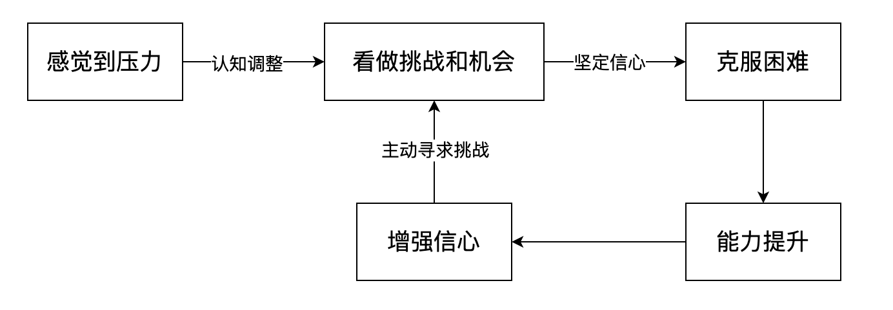

# 一、复用能力

减少【重复】的事情，有意识进行各种【分析总结】，发现事物运动的规律，进行【模式总结】、【经验总结】总结出各种【套路模版】，形成自己的【方法论】和【认识论】

目标是【避免重复】，即【复用能力】，方法是通过【分析总结】发现事物的规律，结果是形成各种【模板套路】

## 1. 分析总结能力

在学习某个新的领域时，如何提高自己的分析总结能力，有哪些具体可实施的方法呢？

- 阅读理解：首先，要深入理解正在学习的主题。这可能涉及阅读相关的书籍、文章或观看教育视频。理解的越深入，分析的能力就越强
- 多问为什么：批判性思维是分析能力的核心。尝试【挑战】你所接受到的信息，问为什么这个观点是正确的，还有什么其他的可能性。这样可以帮助你发展出批判性思维，能从【多角度】看问题。
- 输出自己的理解：学习过程中，定期做笔记和总结所学的知识。通过【将你的理解写出来】，可以帮助你理清思路，也有助于巩固记忆。
- 灵活运用：尝试将新知识【应用】于实际问题中，或者将它与你已经知道的知识相【联系】。这样可以帮助你深入理解新的信息，并且提高你的创造性思维。
- 讨论和交流：如果可能的话，尝试与他人讨论你正在学习的主题。他们可能会提供不同的视角，帮助你发现自己可能忽视的方面。
- 复习和反思：定期回顾你所学的知识，并思考你对该主题的理解是否有所改变。这种反思的过程可以帮助你更好地了解你的学习过程，并找出需要改进的地方。
- 不断练习：不断的练习是提高任何技能的关键。尝试用所学的新知识解决问题，这将有助于你提高分析和解决问题的能力。

## 2. 阅读理解能力

那么如何提高自己的阅读理解能力呢？有哪些方法和误区？

阅读理解能力是一项基础技能，它影响到我们的学习、工作以及生活。以下是一些提高阅读理解能力的方法：

1. **预读**：在深入阅读前，先大致浏览一遍全文。查看文章的标题、副标题、图片、图表以及每段的首句和尾句，能帮助你对文章的主旨和结构有一个大概的理解。
2. **标注和做笔记**：在阅读过程中，划出重要的信息，做出一些你自己的笔记。这不仅能帮助你保持注意力，也可以帮助你记住和理解内容。
3. **提问**：在阅读过程中，对于你不明白的地方，不要犹豫，提出问题。这可以帮助你发现自己的理解盲点，并激发你进一步探索和学习的欲望。
4. **总结和复述**：在阅读一段文字后，试着用自己的话来复述或总结它。这可以检验你是否真正理解了内容。
5. **练习**：阅读理解能力需要时间来提高。阅读各种类型的文章，例如新闻、小说、科学文章等，能够帮助你在各种情况下都能提高理解能力。
6. **扩展词汇量**：理解一个文章的能力很大程度上依赖于你的词汇量。遇到新单词时，查找其定义并尝试在实际语境中使用。

然而，在提高阅读理解能力的过程中，也存在一些常见的误区，如：

1. **忽视上下文**：理解一个词语或句子的意思，不仅要看它本身，也要看它在文章中的上下文。忽视上下文可能导致理解偏差。
2. **过分依赖字典**：虽然查字典对于理解新单词很有帮助，但是过度依赖字典可能打断你的阅读流程，影响你对全文的理解。有时，根据上下文推测单词的意思可能更有帮助。
3. **仓促阅读**：阅读不是速度比赛，而是理解和吸收信息的过程。花时间去理解并思考你所阅读的内容，比赶快读完更重要。

对于技术类的参考文档，如何进行有效的阅读和理解？给出具体的步骤方法

阅读和理解技术文档需要特定的技巧，特别是当你正在尝试理解新的工具、语言或者框架时。下面是一些具体的步骤和方法：

1. **了解大纲**：在开始深入阅读前，先通读整个文档的目录或大纲，以理解其内容的整体结构和流程。
2. **分段阅读**：不要试图一次性阅读完整个文档。而应该将其分成更小的部分，专注于理解每一部分，然后再进入下一部分。
3. **深入理解关键概念**：确保你理解了文档中的关键概念和术语。如果你不确定某个术语的含义，查找相关的定义或背景信息。
4. **做笔记**：在阅读过程中，记下重要的信息、你的问题和需要进一步研究的主题。这可以帮助你理清你的思路，也可以方便你以后参考。
5. **实践操作**：尽可能地将文档中的示例或教程在实际环境中操作一遍。通过实际操作，可以帮助你更好地理解和记住你所阅读的内容。
6. **参与讨论**：如果你有问题或者困难，不要犹豫去问。可以寻找在线社区或者论坛，那里可能有很多人可以帮助你。
7. **定期复习**：在你阅读文档的几天或几周后，再回头看一下你的笔记，或者再阅读一次你之前觉得难理解的部分。复习可以帮助你巩固记忆，也可以让你有新的理解。
8. **扩大阅读范围**：尽可能多地阅读关于你正在学习的技术的相关文章、博客或教程。多角度的理解可以帮助你更好地掌握这个技术。

## 3. 设计模式

软件中的设计模式就是经过分析总结各种软件设计后形成的【模版套路】，本质是【降低复杂度】和【提高复用能力】

设计模式的几大原则主要有以下几个：

【降低复杂度】：单一职责、接口隔离、依赖倒置

【提高复用能力】：开闭原则、里氏替换、依赖倒置

1. **单一职责原则（Single Responsibility Principle, SRP）**：一个类只应该有一个引起变化的原因。这个原则强调的是尽量降低类的复杂度，一个类只负责一项职责。
2. **开闭原则（Open-Closed Principle, OCP）**：软件实体（类、模块、函数等等）应当对扩展开放，对修改关闭。这意味着我们应当允许在不改变现有代码的前提下，增加新的功能。
3. **里氏替换原则（Liskov Substitution Principle, LSP）**：子类型必须能够替换它们的基类型（即子类对象必须能够替换父类对象）。
4. **接口隔离原则（Interface Segregation Principle, ISP）**：使用多个特定的接口，比使用单一的总接口要好。这个原则主张将一个大的接口分解为若干个小的接口，每个接口服务于特定的用户类。
5. **依赖倒置原则（Dependency Inversion Principle, DIP）**：依赖于抽象，不依赖于具体。这个原则强调的是程序的依赖关系应当是面向接口的，不应当面向具体实现。

举例来说：

- **单一职责原则**：可能没有具体的设计模式与之关联，但是它对于类和模块的设计极其重要。
- **开闭原则**：策略模式（Strategy）和装饰模式（Decorator）都是实践这个原则的很好的例子。这两种模式都允许在不修改原始类的前提下，增加新的行为。
- **里氏替换原则**：所有使用基类（或接口）及其子类的设计模式都在使用这个原则，比如工厂方法模式（Factory Method）和模板方法模式（Template Method）。
- **接口隔离原则**：适配器模式（Adapter）是一个使用这个原则的例子。适配器模式可以将一个大的接口转换为几个更小的接口。
- **依赖倒置原则**：依赖注入是这个原则的一个实现方式。工厂模式（Factory）、抽象工厂模式（Abstract Factory）和桥接模式（Bridge）都是这个原则的实践者，它们都强调依赖抽象而不依赖具体实现。

# 二、方法论

## 2.1 复用/委托

做事之前，先思考能否避免重复能不能不做，如果不能复用和委托给第三方，只做最重要的是

## 2.2 以终为始

以产出结果反推计划安排，以最终数据指标制定行动目标，以最终产生的价值反思事物的内核本质

## 2.3 计划先行

动手做事前，先有个大致的计划方案，理清流程思路，对整体结构和要素有基本的了解，不要盲目行动

# 三、压力

压力感来自于人体的自主神经系统和内分泌系统，自主神经系统中的交感神经系统在我们感到压力时，会导致"战斗或逃跑"反应。这是一种进化上的【保护机制】，使我们能够快速应对可能的威胁。

当我们的大脑（更具体地说是杏仁核）感知到压力，【交感神经系统】会使心跳加速，血压升高，呼吸加快，眼瞳扩大，肌肉紧张，以准备对威胁做出反应。

【内分泌系统】也在压力反应中发挥作用。压力会刺激下丘脑-垂体-肾上腺（HPA）轴，这是一个包含三个部分的系统：下丘脑、垂体和肾上腺。在应对压力的过程中，下丘脑会释放皮质醇释放因子（CRF），它会刺激垂体释放促肾上腺皮质激素（ACTH）。ACTH然后会刺激肾上腺皮质释放皮质醇。【皮质醇】是一种激素，它能提高血糖水平，提供额外的能量，并抑制非紧急的身体功能（如免疫系统和消化系统），使身体能更好地应对压力。

然而，这种应激反应如果长期存在，可能会对身体健康产生【负面影响】。长期压力可能导致心脏病、高血压、糖尿病、睡眠问题，甚至心理健康问题，如抑郁和焦虑。因此，学习有效应对压力是非常重要的。

如何应对压力？

压力的来源很大程度来自于不合理的【目标设定】和【期望要求】，当目标或期望要求过高，就会产生的压力和【无法胜任】的感觉，进而产生逃避情绪和消极态度。

那么，如何科学合理的设定目标或者管理期望？

应对压力的最好的解药是相信自己能够克服困难和挑战，相信自己能行，即【深刻的自信】。

原则是降低实现目标的难度和期望的高度，【保持自信心】。

具体方法有【SMART】目标设定法和预期管理法。

我能从压力中的到什么好处呢？解决问题或挑战能【提升能力】和【增强自信心】，应当改变思维，把压力看做挑战和机会。

所以，完整的压力挑战闭环是：

