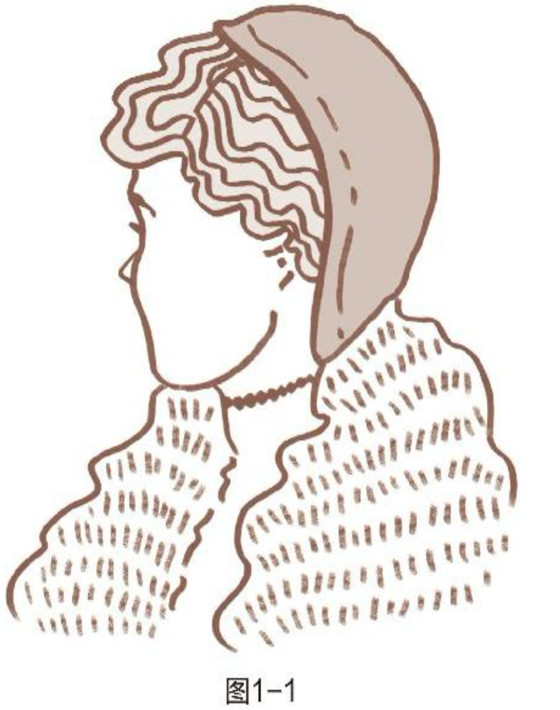

## 一、改变思维方式

### 1. 偏见（个人经验）

基于个人经验形成的思维方式具有很大的局限性，看待事物单一片面，容易形成刻板印象

小实验：你看到的图1-2是一个什么样的人？

先看图1-1 和先看图1-3 ，然后再看图1-2会得出不同的结论，这就是所谓的先入为主的刻板印象

### 2. 思维体系

所以【基于个人经验】的思维方式，往往【导致偏见】，而思维方式决定着个人对待事物的态度和行为，如图

​																								图1-4 主观的、有限的思维体系

【基于原则】的思维体系使我们的观点更客观，拥有更大的视野。比起改变上层的行为和态度，改变底层的思维框架更加彻底有效

​						                      												图1-5 客观的、有效的思维体系

那么什么是原则呢？有哪些原则？它和价值观、实践的区别是什么？

### 1.3 原则

原则是一些稳定的、持久有效的理念和真理，它持久地影响着人的思考、态度、行为等活动

常见的为人处事的原则有：

- 社会层面的【公平】原则，平等和正义的理念
- 个人层面（做人）的【诚信和正直】原则是与人交往、相互信任、合作的基础
- 服务层面（做事）的【品质和卓越】原则，是建立品牌和影响力的基础
- 他人层面（待人）的【耐心和鼓励】原则，是建立友谊、相互帮助的基础
- 外物层面（待事）的【礼貌和客观】原则

实践是某人在当时受限条件场景下的具体活动，它具有主观性和局限性；而原则是普遍的、深刻的真理，适用于个人、家庭、公司和社会，具有普适性。

### 1.4 反原则、误区

【走捷径】一步登天的思维习惯违反了事物发展和个人成长的自然规律：分阶段的、循序渐进的【成长】原则，正所谓【千里之行，始于足下】【一步一个脚印】等格言

【不懂装懂】，承认自己的无知、不足和缺陷是开启求知和智慧的大门

